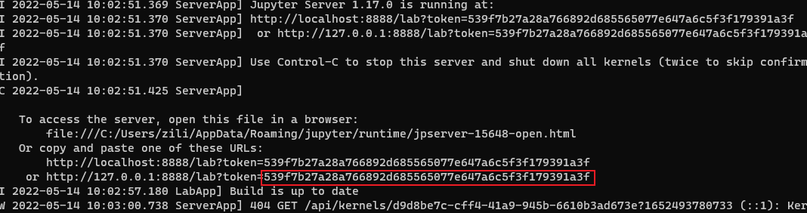
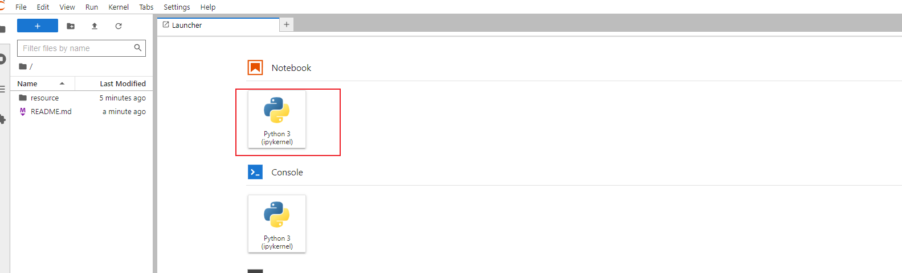
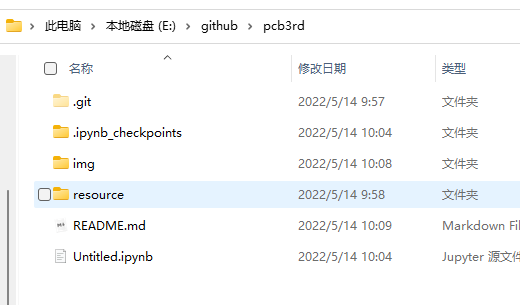
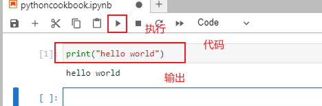

# python cookbook third version
book - D. Beazley, B.K. Jones - Python Cookbook, 3rd Edition. 2013

ebook - [resource/pcb3](resource/pcb3.pdf), perfect version, no watermark

安装`jupyter notebook`
```
pip install jupyterlab -i https://mirrors.aliyun.com/pypi/simple/
```
关于Python的包管理工具`pip`替换为国内源可[参考](https://zhuanlan.zhihu.com/p/109939711)

可以认为`jupyter`就是一个python的交互式编程方式。

```
# 查看帮助
jupyter-lab -h

# 指定jupyter文件存储位置
jupyter-lab 绝对路径[E:\github\pcb3rd]或者相对路径[相对当前所在目录，github\pcb3rd]
```
启动完成之后浏览器中访问页面，如果是本地启动使用`localhost:port`，可以在启动输出信息中查看



这里就是`localhost:8888`，如果浏览器页面要求输入秘钥之类，指的就是`token`值，输入即可。

注：对当前主机来说，`localhost`即`127.0.0.1`


打开页面成功，左边列表是启动指定的本地路径。





本地以`.ipynb`其自有格式存储文件，可以在浏览器中导出为其他格式存储。